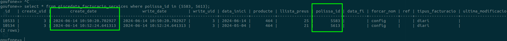

# CAS 238317

```sql
SELECT pl.id, pl.name,servei.create_date
FROM product_pricelist pl
LEFT JOIN llista_preus_servei_contractat_rel pl_rel on pl.id = pl_rel.price_list_id
LEFT JOIN giscedata_servei_contractat_price_list servei on servei.id = pl_rel.servei_contractat_llista_preus_id
where servei.create_date is not null;
```

| ID Llista preus |        Nom Llista preus | Data creacio servei contractat |
|-----------------|-------------------------|--------------------------------|
|             27  | Preu fix Q1 2024        |     2024-01-31 15:13:35.439097 |
|             20  | Indexada domèstica Vera |     2023-06-20 08:25:45.09451  |
|             23  | Indexada Pymes A        |     2024-05-06 16:05:38.031269 |
|             24  | Indexada Pymes B        |     2024-05-06 16:06:49.506051 |
|             25  | Indexada Pymes C        |     2024-05-06 16:07:21.34643  |

```sql
select * from giscedata_facturacio_services where polissa_id in (5583, 5613);
```


