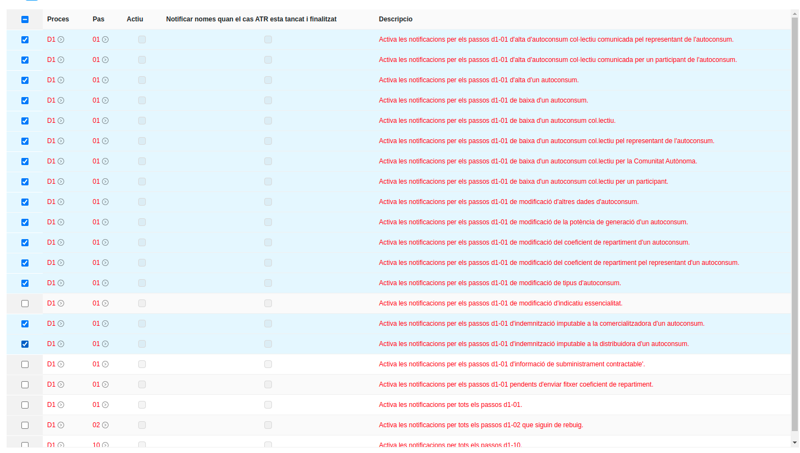

# [243791] C- mail informació incorrecte al clients

## Config actual

### Conf var

- `sw_mail_user_notification_on_activation`: `all`

### Plantilles de mail actives

- ATR B102: Recepción de la comunicación de acceptación
- ATR B105: Recepción de la comunicación de activación
- ATR B102: Recepción de la comunicación de rechazo
- ATR C105: Recepción de la comunicación de activación
- ATR C205: Recepción de la comunicación de activación
- ATR D101: Solicitud de alta de autoconsumo
- Default unpaid invoice notification
- \[BS\] Carta 1
- \[BS\] Carta 2
- \[BS\] Avis de Tall
- Enviar factura per e-mail

## New Config

### Conf var

- `sw_mail_user_notification_on_activation`: `['B1-02', 'B1-05', 'C1-05', 'C2-05']`

### ATR Config

### Plantilles de mail actives

- ATR B102: Recepción de la comunicación de acceptación
- ATR B105: Recepción de la comunicación de activación
- ATR B102: Recepción de la comunicación de rechazo
- ATR C105: Recepción de la comunicación de activación
- ATR C205: Recepción de la comunicación de activación
- ATR D101: Solicitud de alta de autoconsumo
- Default unpaid invoice notification
- \[BS\] Carta 1
- \[BS\] Carta 2
- \[BS\] Avis de Tall
- Enviar factura per e-mail
