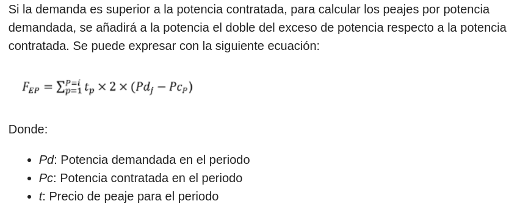
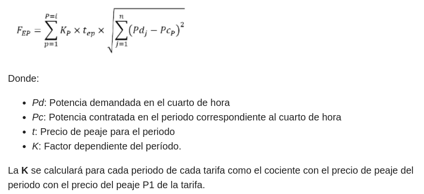

# [239699] MAX ELECTRICIDAD - Diferencia en los excesos de potencia

## Formulas

### Formula Contadores 4 y 5

(potencia_consumida - potencia_contratada) \* 2 \* precio_diario \* dias_facturados

### Formula Contadores 1, 2 y 3

K \* precio_peaje \* raiz cuadrada ( Exceso Potencia (Lectura EP del F1) )

## CUPS

### ES0022000004026052TG (2.0TD) Tipo 5

El F1 contiene una lectura de PM, Maximetro de 200kW.

Si lo calculamos nos da:

- P3: (200 - 15) \* 2 \* 0.09906 \* 32 = 1172.87

Recomendamos reclamar el F1 ya que la distri podria estar facturando mal o enviando lecturas erroneas, teniendo en cuenta que es un cups de 15kW y segun dicen son 200 kW lo que ha llegado a consumir simultaneamente.

### ES0021000003789954XB (3.0TD) Tipo 5

El F1 contiene 6 lecturas de PM, las cuales solo 3 tienen datos y solo 1 se pasa de la potencia contratada, P3.

Si lo calculamos nos da:

- P3: (10,97 - 8) \* 2 \* 0.111643 \* 11 = 7.29

Recomendamos reclamar el F1 ya que la distri podria estar facturando mal o enviando lecturas erroneas.

### ES0021000012460349ZG (3.0TD) Tipo 5

El F1 contiene 6 lecturas de PM, las cuales solo 3 tienen datos y solo 1 se pasa de la potencia contratada, P6.

Si lo calculamos nos da:

- P6: (39,71 - 32) \* 2 \* 0.111643 \* 19 = 32.71

Recomendamos reclamar el F1 ya que la distri podria estar facturando mal o enviando lecturas erroneas.

### ES0021000003547009GS0F (3.0TD) Tipo 5

El F1 contiene 6 lecturas de PM, las cuales solo 3 tienen datos y solo 2 se pasan de la potencia contratada, P6 y P4.

Si lo calculamos nos da:

- P4: (63,55 - 40) \* 2 \* 0.111643 \* 21 = 110.43
- P6: (68,63 - 40) \* 2 \* 0.111643 \* 21 = 134.25

Recomendamos reclamar el F1 ya que la distri podria estar facturando mal o enviando lecturas erroneas.

### ES0021000008561137QM0P (3.0TD) Tipo 5

El F1 contiene 6 lecturas de PM, las cuales solo 3 tienen datos y las 3 se pasan de la potencia contratada.

Si lo calculamos nos da:

- P3: (36,09 - 18) \* 2 \* 0.111643 \* 21 = 84.82
- P4: (34.84 - 18) \* 2 \* 0.111643 \* 21 = 78.96
- P6: (35.69 - 18) \* 2 \* 0.111643 \* 21 = 82.95

Recomendamos reclamar el F1 ya que la distri podria estar facturando mal o enviando lecturas erroneas.

### ES0021000018605969RR0F (6.1TD) Tipo 5

El F1 contiene 6 lecturas de PM, las cuales solo 3 tienen datos y ninguna se pasa de la potencia contratada.

| Periodo | Potencia Demandada | Potencia Contratada |
|---|---|---|
| P3 | 2 | 2,064 |
| P4 | 1 | 2,064 |
| P6 | 2 | 10 |

Recomendamos reclamar el F1 ya que la distri podria estar facturando mal o enviando lecturas erroneas.

### ES0022000007261386KC1P (6.1TD) Tipo 4

El F1 contiene 6 lecturas de PM, las cuales solo 3 tienen datos y las 3 se pasan de la potencia contratada.

Si lo calculamos nos da:

- P3: (57 - 45) \* 2 \* 0.117264 \* 31 = 87.24
- P4: (59 - 45) \* 2 \* 0.117264 \* 31 = 101.78
- P6: (56 - 45) \* 2 \* 0.117264 \* 31 = 79.97

Recomendamos reclamar el F1 ya que la distri podria estar facturando mal o enviando lecturas erroneas.

### ES0021000016768495NC0P (6.1TD) Tipo 3

Este cups al ser tipo 3, se mide por las lecturas EP, Exceso Potencia, las cuales son todas a 0. Recomendamos reclamar el F1 ya que la distri podria estar facturando mal o enviando lecturas erroneas.
